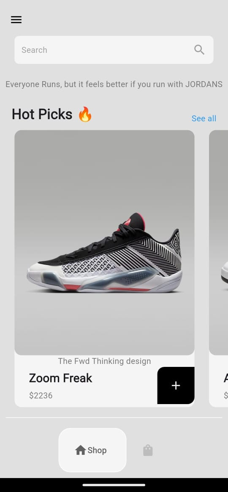
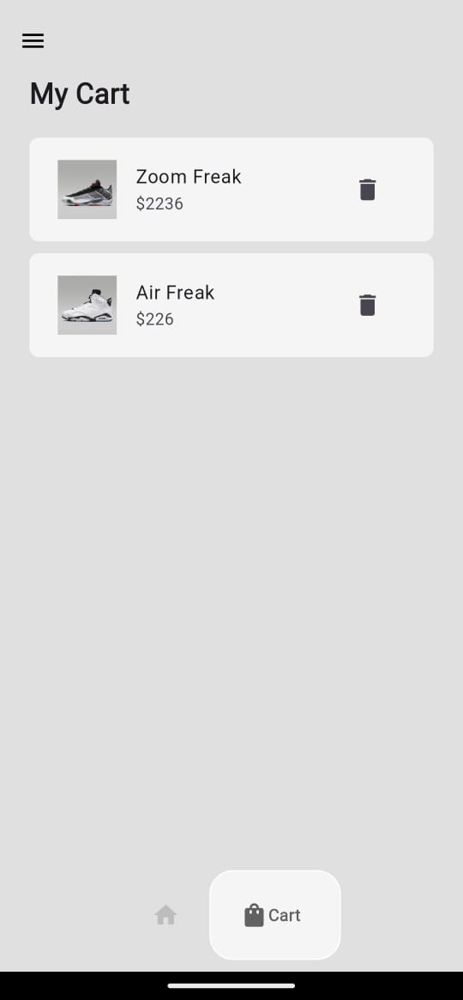
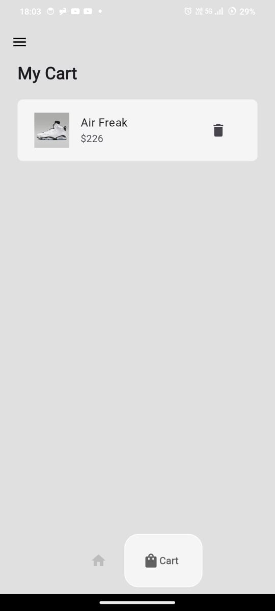

# 👟 ShoeCart App

A stylish and smooth Flutter-based Shoe Store UI. Browse and add your favorite shoes to the cart effortlessly!

---

## 📱 Features
👟 Browse a collection of stylish shoes

🛒 Add shoes to the cart with a single tap

💬 View detailed descriptions and prices

🎨 Beautiful and minimalistic UI

🧩 Modular code with reusable widgets
---

## 🖼️ Screenshots

  
  
    
      
        
          

---

## 🚀 Getting Started

1. **Clone the repository:**
   
bash
   git clone https://github.com/varshithchowdary/ecommerce.git
   cd ecommerce